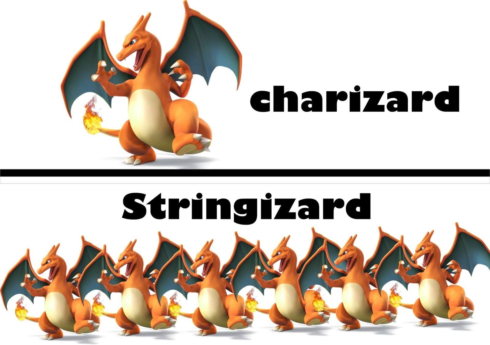

# Podstawy programowania w C++

## Struktura programu

Każdy program w C++ ma określoną strukturę. Podstawowe elementy kodu to:

```cpp
#include <iostream> 
```
Dołączenie standardowej biblioteki "iostream" \
i - input - wejście \
o - output - wyjćcie \
stream - strumień

```cpp
using namespace std;
```

Użycie **using namespace** sprawia, że podstawowe funkcje w c++ nazw nie wymagają pisania przedrostka `std` 
np. używając instrukcji wypisującej `cout`:

```cpp
using namespace std;

cout << "Hello there";
```

```cpp
// Bez uzycia przestrzeni nazw
std::cout << "General Kenobi";
```

Kolejnym elementem naszego programu będzie funkcja główna `main`. Jest to pierwsza funkcja uruchamiana podczas działania programu. Funkcja ta przyjmuje typ liczby całkowitej i zwraca wartość 0 w przypadku gdy program wykona się poprawnie. 

```cpp
int main(){
    //W tym miejscu pojawi sie kod programu


    return 0;
}
```

### Komentarze

Ważną funkcjonalnością każdego języka jest możliwość pisania komentarzy, czyli fragmentów programu które nie są wykonywane. W komentarzach możemy umieszczać wyjaśnienie poszczególnych częsci, albo tworzyć własne notatki na później. W C++ do komentowania używa się znaków `//`. Wszystko po tym znaku w danej linii zostanie zakomentowane, i program nie wykona tej częsci. W niektórych środowiskach komentarz można wykonać za pomocą odpowiedniego skrótu klawiszowego, np. `CTRL + /`.

```cpp
// Stworzenie zmiennej a
int a = 5 // Przypisanie wartości 5 do zmiennej a
cout << a;
a = 62
//cout << (a + 2); --> Ta linijka sie nie wykona
```

Możemy także stworzyć komentarz który zakomentuje jakiś fragment kodu, a nie tylko daną linijkę. W tym celu używamy znaków `/*` do otwarcia komentarza i znaków `*/` do jego zamknięcia.
```cpp
/*
a = 32
Moim zdaniem to nie ma tak, że
jest dobrze, albo że nie dobrze
Gdybym miał powiedzieć co cenię w życiu najbardziej
Powiedziałbym, że ludzi.
*/
int a = 5 + 32;
cout << a;
```
Przed każdym następnym zadaniem będziemy używać komentarza z numerem zadania.


### Zadanie 1
Skopiuj zawartość pliku `template.cpp` do pliku `main.cpp`. Używając instrukcji `cout` wypisz napis "Hello world!". Dodaj trzy kolejne instrukcje które wypiszą:
- Dzisiejszą datę
- Napis "Operacje na liczbach"
- Działanie 4 + 5


## Proste operacje
C++ ma zdolność do wykonywania obliczeń. Tak jak we wcześniejszym przykładzie, działania matematyczne możemy bezpośrednio wypisywać w instrukcji "cout".
```cpp
cout << 4+5 << endl;
cout << 4*6 << endl;
cout << 4/0 << endl;
```
> W C++ jeśli kompilacja się nie powiedzie, to po uruchomieniu programu zostanie wyświetlony komunikat z błędem np. `divide or mod by zero`.

### Operatory
| Operator numeryczny | opis             |
|---------------------|------------------|
| x + y               | suma x oraz y    |
| x - y               | różnica x oraz y |
| x * y               | iloczyn x oraz y |
| x / y               | iloraz x oraz y  |
| x % y               | reszta z dzielenia x / y  |
| x++        | zwiększenie x o 1 (inkrementacja)  |
| x--      | zmniejszenie x o 1 (dekrementacja) |


| Operator porównania | opis             |
|---------------------|------------------|
| x != y               | rózne    |
| x == y               | równe |
| x > y                | większe |
| x < y                | mniejsze  |
| x >= y               | większe lub równe  |
| x <= y               | mniejsze lub równe  |


### Zadanie 2

- Wypróbuj działania arytmetyczne z tabeli "Operatory" dla dwóch dowolnych liczb wykorzystując instrukcję cout.
- Sprawdź działanie operatorów porównania. Co zostało wypisane na konsoli?
- Porównaj dwie liczby: (0.222222222222222222224 == 0.2222222222222222222222225). Jaki jest wynik działnia programu? Co powoduje zwrócenie takiego wyniku?

## Zmienne

Zmienne odgrywają bardzo ważną rolę w większości języków programowania, a C++ nie jest wyjątkiem.  
Zmienna umożliwia zapisanie wartości poprzez przypisanie jej do nazwy, którą można wykorzystać później w programie.

Zmienne w C++ przechowują **wyłącznie wartości określonego typu**, na przykład:
- liczby całkowite,
- tekst,
- liczby rzeczywiste.

Tworzenie zmiennej odbywa się w **dwóch etapach**:

1. **Deklaracja** – określenie typu oraz nazwy zmiennej  
2. **Inicjalizacja** – przypisanie konkretnej wartości

---

### Podstawowe typy zmiennych w C++

| Typ      | Opis                          | Przykład        |
|----------|-------------------------------|-----------------|
| `int`    | liczba całkowita               | `10`            |
| `char`   | pojedynczy znak                | `'A'`           |
| `string` | ciąg znaków (tekst)            | `"C++"`         |
| `double` | liczba rzeczywista             | `3.14`          |
| `bool`   | wartość logiczna (prawda/fałsz)| `true`, `false` |

---

### Modyfikacja wartości zmiennej

Zmiana wartości zmiennej **nie wymaga ponownego podawania typu** – wystarczy nazwa zmiennej i nowa wartość. Zmienna nie może w locie zmienić swojego typu np.
nie możemy przypisać do zmiennej typu `int` wartości tekstowej np. `tekst`.

```cpp
int liczba = 5;
liczba = 10;
```

Zmienne wypisujemy tak samo jak tekst w instrukcji `cout` ale bez użycia znaku cudzysłowia:

```cpp
int liczba = 5;
cout << liczba << endl; //Zostanie wypisane 5

```

Możemy łączyć wypisywanie zmiennych oraz tekstu np:
```cpp
int liczba = 5;
cout << "Wybrana liczba to: " << liczba << endl;
```

Obowiązują pewne ograniczenia dotyczące znaków, które mogą być używane w nazwach zmiennych C++. Dozwolone są tylko
litery, cyfry i podkreślenia. Ponadto nie mogą zaczynać się od liczb. Nieprzestrzeganie tych zasad powoduje błędy.
```c++
int to_poprawna_nazwa_zmiennej = 7;
int 123abc = 7;

error: expected an identifier
```
>C++ to język programowania z uwzględnieniem wielkości liter. Tak więc, Nazwisko i nazwisko to dwie różne nazwy zmiennych w c++.
Próba odniesienia do zmiennej, która nie została przypisana powoduje błąd.
```cpp
string foo = "napis";
cout << foo << endl;
'napis'
cout << bar;
identifier "bar" is undefined
```
>Zmienne `foo` i `bar` są używane jako nazwy zastępcze w przykładowym kodzie, aby coś zademonstrować. 

### Zadanie 3
Utwórz zmienną `imie` i przypisz do niej swoje imię. Utwórz zmienną `wiek` do której przypisz swój wiek. Dobierz odpowiedni typ zmiennej. Wypisz obie zmienne w postaci "Jestem {{imie}} i mam {{lat}}". 


## Wprowadzanie danych
Przydatną funkcją jest możliwość wprowadzania danych przez użytkownika - do tego służy instrukcja `cin` - wejście i ma ona postać:
```c++
int x;
cout << "Podaj liczbe: "; //Podaj liczbe i nacisnij enter
cin >>  x;
cout << "Twoja liczba to: " << x;

```
### Zadanie 3
Napisz program, który zapyta użytkownika o imię, a potem wyświetli powitanie z wykorzystaniem podanego imienia.


### Zadanie 4
Stwórz zmienne `a` oraz `b` i przypisz do nich dwie dowolne liczby. Dodaj zmienną wynik do której przypiszesz wynik działania: `2 * a + b^2`. Wypisz obie zmienne oraz wynik. 

### Zadanie 5
Stwórz zmienne `x` oraz `y`. Wartości mają zostać podane przez użytkownika przy pomocji funkcji `cin`. Na podanych liczbach wykonaj dwa dowolne działania matematyczne i wypisz wyniki.


